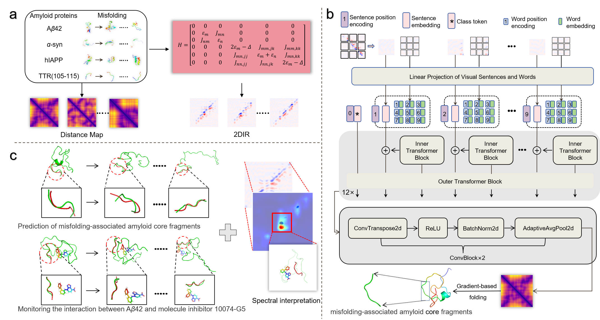
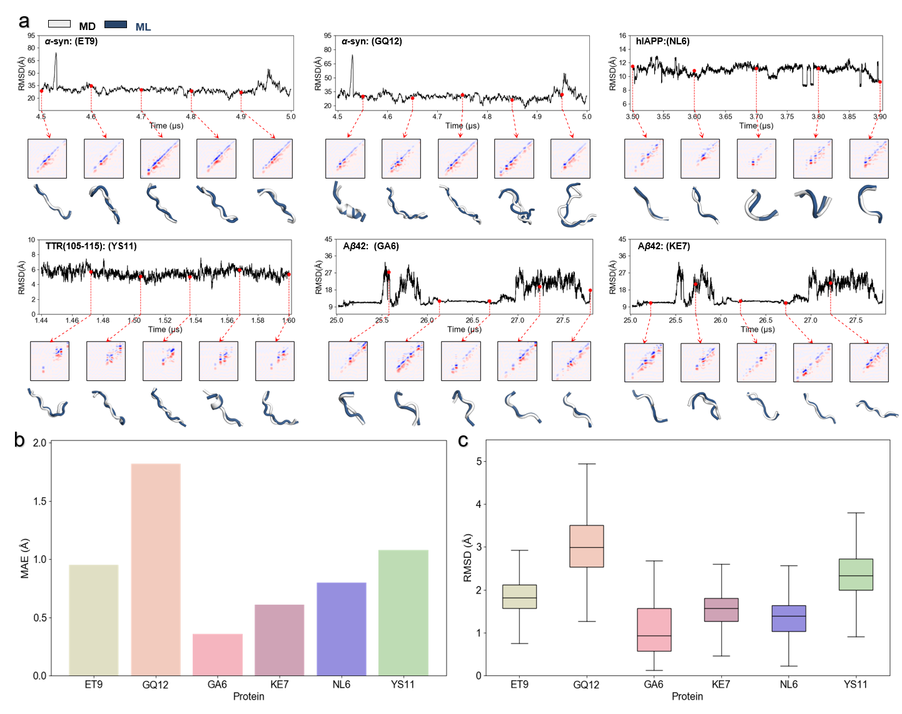

# Spectral-driven Machine Learning for Amyloid Core Conformational Prediction

📌 Introduction

Amyloid protein misfolding underlies a range of neurodegenerative diseases, including Alzheimer’s, Parkinson’s, and Type II diabetes. Predicting the structural evolution of amyloidogenic protein fragments remains a fundamental challenge due to their dynamic and heterogeneous conformations.
This project introduces a spectral-driven machine learning framework that integrates two-dimensional infrared (2DIR) spectroscopy simulations with Transformer-in-Transformer (TNT-S) models to predict misfolding-associated amyloid core structures.
### Fig. 1

### Fig. 2

