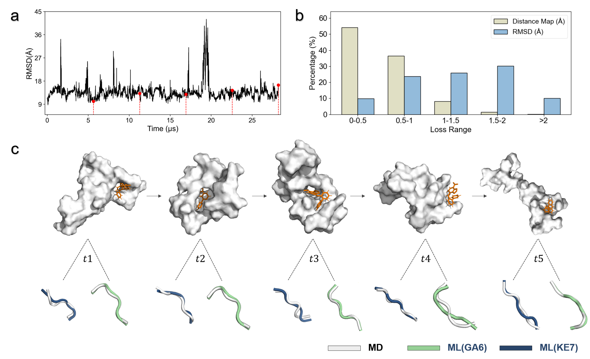

# Spectral-driven Machine Learning for Amyloid Core Conformational Prediction

# 📌 Introduction
Amyloid protein misfolding underlies a range of neurodegenerative diseases, including Alzheimer’s, Parkinson’s, and Type II diabetes. Predicting the structural evolution of amyloidogenic protein fragments remains a fundamental challenge due to their dynamic and heterogeneous conformations.
This project introduces a spectral-driven machine learning framework that integrates two-dimensional infrared (2DIR) spectroscopy simulations with Transformer-in-Transformer (TNT-S) models to predict misfolding-associated amyloid core structures.

## ⚙️Workflow
The workflow consists of three stages (Fig. 1):  
1. Dataset construction  
2. Machine learning protocol  
3. Model application
   
The dataset used in this project can be accessed here: [Dataset Link](https://example.com/your-dataset-url).

### Fig. 1

## 📊 Results
### The model demonstrates robust predictive capability across multiple amyloidogenic fragments (Fig. 2):

### Model-informed prediction of the structural evolution of Aβ42 during molecule inhibitor binding (Fig. 3):

